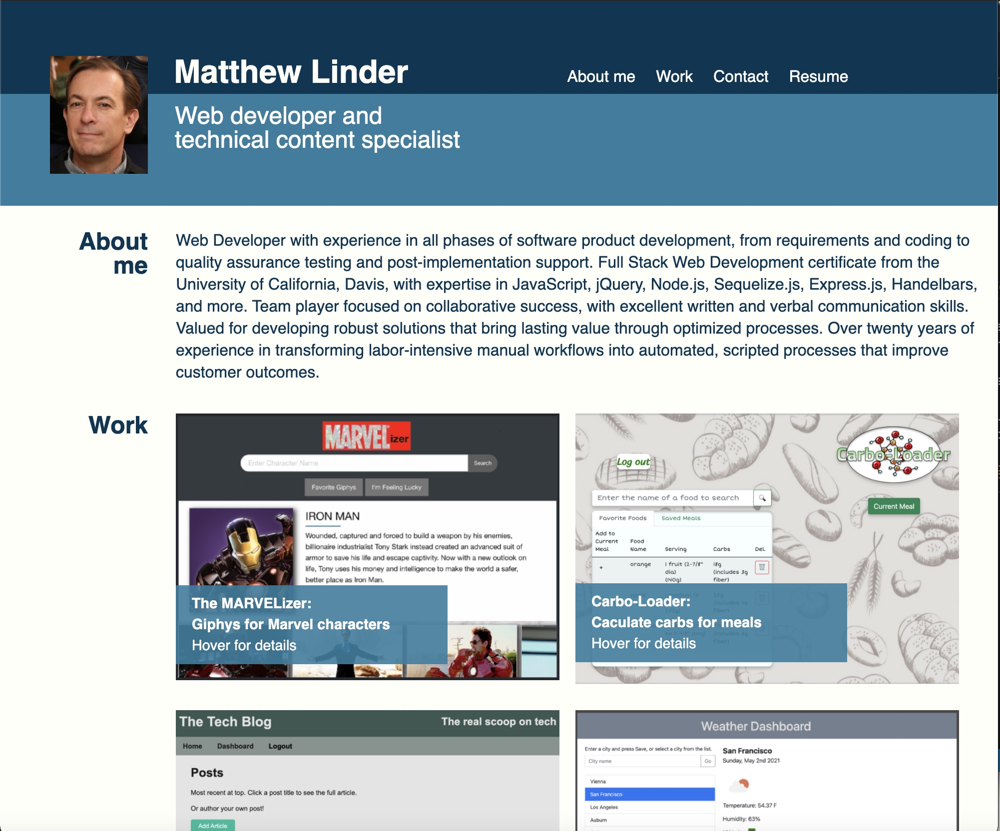

# mjl_portfolio

Web-based portfolio showcasing my projects. To create this, I used a number of the techniques and tools such as flexbox, media queries, and CSS variables. 

* [Published website](https://mlin901.github.io/mjl_portfolio/)

## Plans for improvement

* The graphic design still needs a lot of improvement. Improvements are needed for font, color, placement, and graphics. 
* The functionality is a bit rough with smaller screen sizes. I think the design and functionality in this regard could be improved quite a bit by using Bootstrap components.
* The projects that the portfolio highlights need improvement.

## Screenshot of current state of portfolio (published in GitHub Pages)

