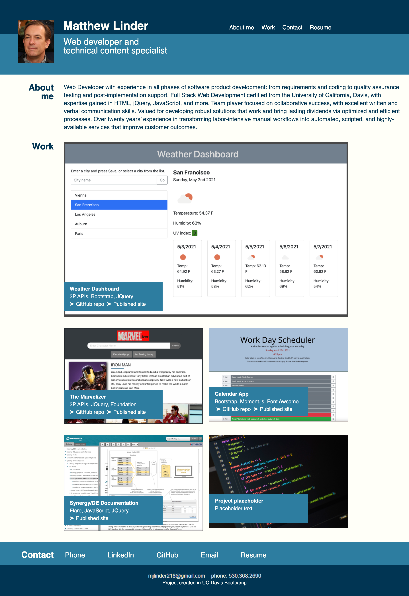
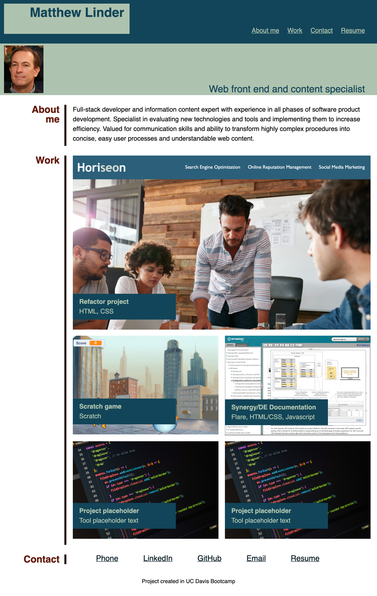

# mjl_portfolio

This web-based portfolio is designed to "showcase...skills and talents to employers" (as described in the readme.md file for the first phase of this assignment). To create this, I used a number of the techniques and tools we have studied in UCD Bootcamp - e.g., flexbox, media queries, and CSS variables. 

I still do not have enough web applications to showcase at this point, so the portfolio has a placeholder for a future project, and the projects that it does showcase will be either improved or replaced in the future by more substantial and compelling web projects. 

* [Published website](https://mlin901.github.io/mjl_portfolio/)

## Plans for improvement

* The graphic design still needs a lot of improvement. Improvements are needed for font, color, placement, and graphics (e.g., large blocks of color could be replaced by graphics).
* The functionality is a bit rough with smaller screen sizes. I think the design and functionality in this regard could be improved quite a bit by using Bootstrap components.
* The "About me" text is still too centered on my current position as an information developer. As the bootcamp progresses, I hope to shift that emphasis more and more toward a full-stack developer emphasis.

## Screenshot of current state of portfolio (published in GitHub Pages)

## Screenshot of first version of portfolio (published in GitHub Pages)

